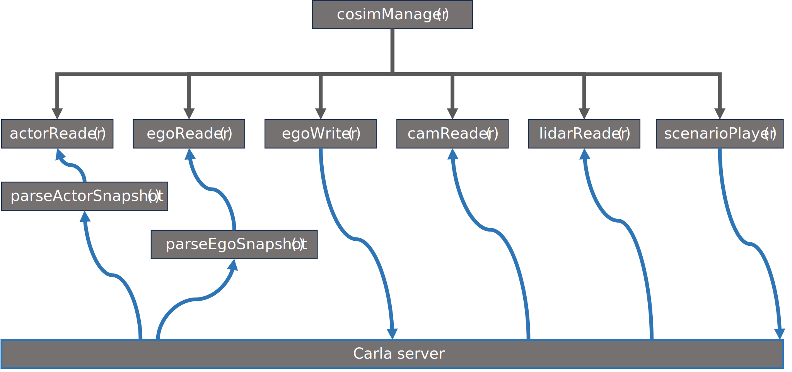

# CoSIM Manager

The CoSim Manager is responsible for managing the simulation, calling the various client scripts, passing them data and starting and stopping scenarios.

A high-level architecture is shown here.

Here we list the identifier of the functions/class we commented

## cosimManager.py
::: src.sim.cosimManager