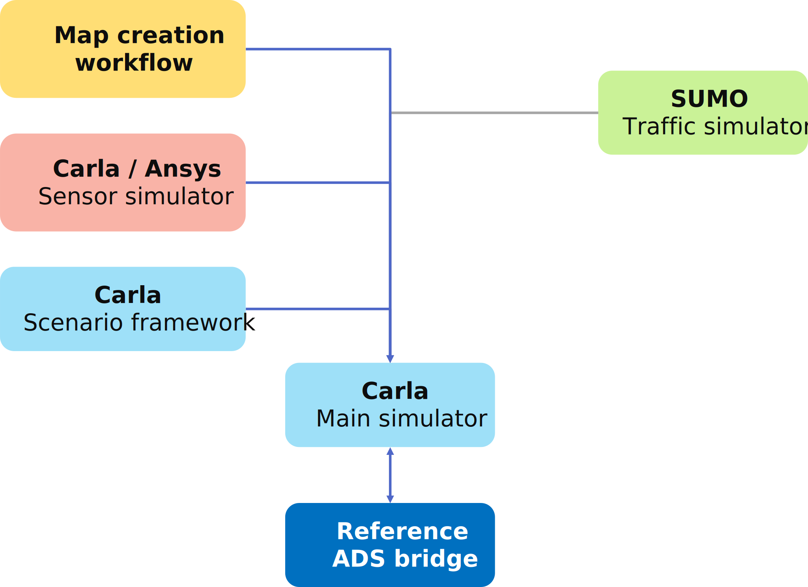

# CoSIM Architecture

A high level architecture of the CoSIM framework is illustrated below.

This simulation framework and its reference implementation have mostly been built with open-source tools. However, the same general architecture can be used and supplanted with any commercial or custom/proprietary tools as needed. The current version of the simulation framework consists of a reference bridge to the Baidu Apollo ADS. This reference bridge can serve as a good baseline to create an interface between the framework and any ADS.

## Manager

an example layout

## Third Party Software

[link test](../index.md) 