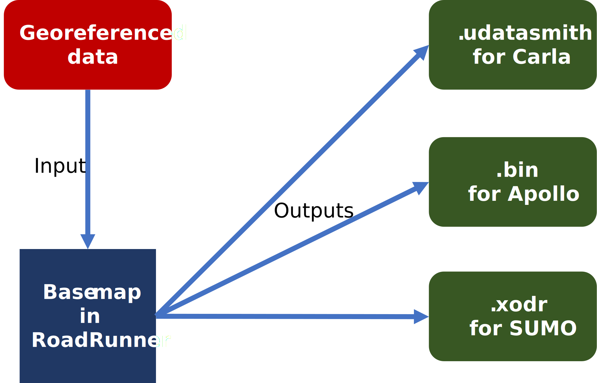

# Map creation workflow
This section describes the workflow for creating maps compliant with the CoSIM framework and its reference bridge to the Baidu Apollo ADS.

[MathWorks RoadRunner](https://www.mathworks.com/products/roadrunner.html) can be used for modelling and exporting the map in various formats for the CoSIM framework. RoadRunner is a versatile and easy-to-use 3D road and environment modelling tool with powerful functionalities to import and export multiple different file formats focused on vehicle and autonomous driving testing.

RoadRunner is widely used by both industry and academia. Roads and associated infrastructure can be placed in a 3D space with relative ease using a straightforward GUI. Various aspects of the road network such as textures, lane markings, lane widths and so on can be customized as per requirements.

## Formats required

Once the base map is generated on RoadRunner, it is exported to different formats as per the requirements of the individual tools in the simulation toolchain. These are as follows:

1. **Carla** - As per the latest verion of Carla, [RoadRunner exports](https://carla.readthedocs.io/en/latest/tuto_M_generate_map/) have to be fulfilled in the Unreal Editor Datasmith format along with an OpenDRIVE file. Datasmith serves as a robust file format and workflow toolkit designed to streamline the integration of 3D data from various design and modeling applications into Unreal Engine. It intelligently converts lights and materials, preserving metadata, hierarchy, and enabling automatic updates for iterative design processes. The format facilitates photorealistic visualization within Unreal Engine, making it easy to quickly generate and update road models from RoadRunner.
2. **Apollo** - Apollo requires the map in a specific ProtoBuf HD map format with semantic information about road features such as individual lanes. RoadRunner supports Apollo export in both plaintext and binary formats.
3. **SUMO** - SUMO, if used for traffic simulation, requires the OpenDRIVE file to generate its own map network. Once the file is imported into SUMO, it must be post-processed to enable left-hand driving, as SUMO in its default configuration only supports right-hand driving. For more details, refer [here](https://sumo.dlr.de/docs/FAQ.html).

## Base map

For generating a map based on real-world locations, the first step of the workflow is to import ground-truth geospatial data. This could be in the form of GIS vector data, pointclouds or even accurately scaled drawings or map images.

For example, we can use the Singapore Land Traffic Authority's (LTA) publicly available kerbline dataset as the ground-truth data. The kerbline data is available freely as a ShapeFile (SHP) for the entire island of Singapore on the [Land Transport DataMall](https://datamall.lta.gov.sg/content/datamall/en/static-data.html#Whole%20Island). Using a free GIS software such as QGIS, we can isolate the area required for the simulation map before exporting the SHP file to [GPS Exchange (GPX) format](https://en.wikipedia.org/wiki/GPS_Exchange_Format) or [GeoJSON format](https://en.wikipedia.org/wiki/GeoJSON) which can be imported into the RoadRunner workspace.

## Export

The RoadRunner map, once modelled, can be [exported to various formats](https://www.mathworks.com/videos/importing-and-exporting-scenes-with-roadrunner-1597837006663.html) as is required for the simulation test framework. The maps used for the ADS and the simulator have to match.

For the reference implentation, the map is recommended to be exported to the Unreal Datasmith format for Carla and the Baidu Apollo .bin format for the ADS. Carla coordinate system is the same as the exported map coordinates except with an inverted y-axis (as -y).

### Apollo map

The Apollo map has an arbitrary offset which is specified in the `config.py` file and is applied to the localization messages.

1. To find this offset, create a 5m long road from (0,0) to (0,5) in RoadRunner. Export the OpenDrive (.xodr) and Apollo map (.txt, .bin) formats.

2. From the .xodr, find the ID of the road. Find the same road ID in the Apollo .txt file and note the x and y values. These values are the offset. This offset value must be updated in the `config.py` file.

3. After this, copy the map files into a new directory (named after your map) on the ADS machine at `/apollo/modules/maps/data/`. The file should be named `base_map.bin`.

4. `bazel-bin/modules/map/tools/proto_map_generator --map_dir=INPUT_DIR
--output_dir=OUTPUT_DIR`

5. `bazel-bin/modules/map/tools/sim_map_generator --map_dir=INPUT_DIR
--output_dir=OUTPUT_DIR`

6. `scripts/generate_routing_topo_graph.sh --map_dir=INPUT_DIR`

Refer [here](https://github.com/ApolloAuto/apollo/tree/master/modules/map/data) for more details on Apollo's map requirements.

### Carla map

To import maps into Carla, users may follow the official guide [here](https://carla.readthedocs.io/en/latest/tuto_M_custom_map_overview/). This includes [detailed instructions](https://carla.readthedocs.io/en/latest/tuto_M_generate_map/) on how to use RoadRunner to create maps for Carla.