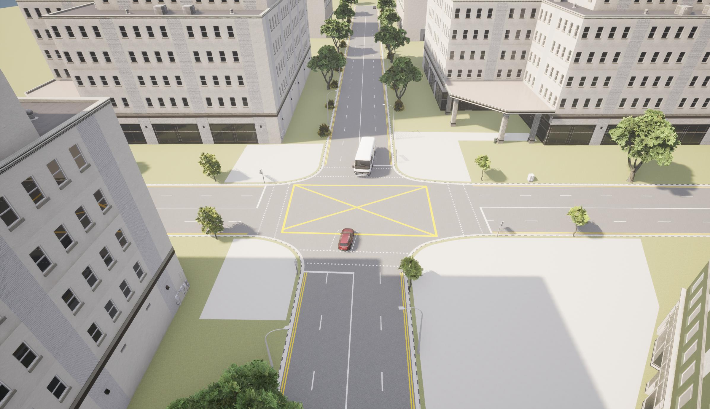

# CoSim Documentation

*A screenshot from Carla running as part of the CoSIM framework*

## Introduction

CoSim stands for CETRAN open-source Simulation framework. The framework is modular with different tools performing distinct tasks and the framework is able to achieve full system-level software-in-the-loop simulation testing of an autonomous vehicle (AV).

The co-simulation architecture incorporates the following elements:

1. A highly customizable and modular simulation framework built on top of the open-source [Carla simulator](https://github.com/carla-simulator/carla).
2. A reference ADS bridge to [Baidu Apollo](https://github.com/ApolloAuto/apollo) from the Carla simulation framework. The bridge is highly parallelized with multiprocessing-based Carla clients and communicates over a custom low overhead TCP messaging protocol developed by CETRAN.
3. Various custom-developed tools and scripts used to facilitate interconnection between disparate aspects of the simulation framework.

This simulation framework and its reference implementation, as described here, consists of open-source tools and components. However, the same general architecture can be used and supplanted with any commercial or custom/proprietary tools as needed.

The framework is able to output sensor data and incorporate realistic and randomized road traffic and pedestrian interactions along with the capability to script complex scenarios which can be used to challenge the various subsystems of an AV.

## Project layout

    mkdocs.yml    # The configuration file.
    docs/
        index.md  # The documentation homepage.
        ...       # Other markdown pages, images and other files.
    src/
        ads/
            apolloBridgeServer.py           # The main server-side script for the Apollo bridge. Run inside Apollo Docker.
            cyberReader.py                  # Module to read control commands from Apollo CyberRT.
            cyberWriter.py                  # Module to write simulation messages into Apollo CyberRT.
        sim/
            modules/                        # Directory containing protobuf modules for Apollo messages
            agents/                         # Directory containing some Carla Python API modules for scenario generation and execution
            cosimManager.py                 # The main script for the CoSIM simulation framework.
            bridgeClient.py                 # The main client-side classes for the Apollo bridge.
            apolloEncode.py                 # Methods to encode and decode ProtoBuf messages as required by Apollo.
            sensorManager.py                # Module to define ego vehicle sensors and placement
            scenarioManager.py              # Module to spawn actors and make them execute scenarios using the Carla Python API
            config.py                       # File containing configuration parameters
            sensorConfig.py                 # File containing configuration parameters pertaining to the sensor setup of the ego vehicle

To get started, take a look at the general architecture of the CoSim framework in the next section.